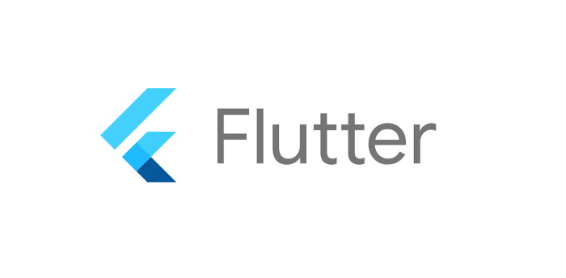

# Flutter Resources
A list of Free Flutter resources that will help people get started with Flutter.

# Content
- [Introduction](#introduction)
- [Beginner](#beginner)
- [Intermediate](#intermediate)
- [Advanced](#advanced)
- [UI Kit](#ui-kit)
- [Youtube Channels](#youtube-channels)
- [Books](#books)
- [Firebase](#firebase)
- [Machine Learning](#machine-learning)
- [Contributing](#contributing)
- [Support Me](#support-me)

# Introduction
- [Flutter](https://flutter.dev/) is Google’s UI toolkit for building beautiful, natively compiled applications for mobile, web, and desktop from a single codebase
- [Flutter Installation](https://flutter.dev/docs/get-started/install) - Get Started by installing Flutter in your machine
- [Flutter for Beginners](https://www.youtube.com/watch?v=fmPmrJGbb6w&list=PLlxmoA0rQ-Lw6tAs2fGFuXGP13-dWdKsB) - Youtube playlist about building apps with Flutter
- [Dart for Beginners](https://www.youtube.com/watch?v=5rtujDjt50I&list=PLlxmoA0rQ-LyHW9voBdNo4gEEIh0SjG-q) - Youtube playlist about the Dart programming language
- [Flutter Basics](https://www.youtube.com/watch?v=1ukSR1GRtMU&list=PL4cUxeGkcC9jLYyp2Aoh6hcWuxFDX6PBJ) - Youtube playlist that teaches the basics and uses the learned knowledge to create a Time app
- [Http Requests](https://medium.com/swlh/how-to-make-http-requests-in-flutter-d12e98ee1cef) - A medium article teaching how to make http requests to a server

# Beginner
- [Widget of the Week](https://www.youtube.com/playlist?list=PLjxrf2q8roU23XGwz3Km7sQZFTdB996iG) - Introducing new widgets every week by [Flutter](https://www.youtube.com/c/flutterdev)
- [Roadmap to Flutter Development](https://github.com/olexale/flutter_roadmap) - Visual roadmap with principles, patterns, and frameworks for Flutter newbies by [Olexandr Leuschenko](https://github.com/olexale)
- [Layout Cheat Sheet](https://medium.com/flutter-community/flutter-layout-cheat-sheet-5363348d037e) - Extensive examples of layout widgets by [Tomek Polański](https://github.com/tomaszpolanski)

# Intermediate
- [FlutterFire](https://firebase.flutter.dev/docs/overview/) - FlutterFire is a set of Flutter plugins which connect your Flutter application to [Firebase](https://firebase.google.com/)
- [State Management](https://flutter.dev/docs/development/data-and-backend/state-mgmt/options) - A list of State-Management Approaches in Flutter
- [Provider](https://pub.dev/packages/provider) - A wrapper around InheritedWidget to make them easier to use and more reusable by [Remi Rousselet](https://github.com/rrousselGit)
- [Animation Intro](https://flutter.dev/docs/development/ui/animations) - An introduction in creating animations by [Flutter](https://flutter.dev/)
- [Animation Intro Youtube Playlist Version](https://www.youtube.com/watch?v=GXIJJkq_H8g&list=PLjxrf2q8roU2v6UqYlt_KPaXlnjbYySua) by [Flutter](https://www.youtube.com/c/flutterdev)
- [Animation Tutorial](https://www.youtube.com/watch?v=OtrWXLfGtqE&list=PL4cUxeGkcC9gP1qg8yj-Jokef29VRCLt1) - A video playlist tutorial about using animations in Flutter by [NetNinja](https://www.youtube.com/channel/UCW5YeuERMmlnqo4oq8vwUpg)
- [Animation CheatSheet](https://codesearchonline.com/index.php/flutter-implicit-animation/) - Flutter Implicit Animation Widgets CheatSheet
- [Animated Selection Slide](https://github.com/sbilketay/animated_selection_slide/blob/master/README.md) - Animated Selection Slide

# Advanced 
- [Flutter Bloc](https://pub.dev/packages/flutter_bloc) - A flutter package that helps implementing the bloc architecture by [Felix Angelov](https://github.com/felangel/)
- [RxDart](https://pub.dev/packages/rxdart) - A wrapper around streams that adds additional capabilities to Streams and StreamControllers by [ReactiveX](https://github.com/ReactiveX)
- [Rive Introduction](https://www.youtube.com/watch?v=6QZy5sYozVI) - An introduction in using Rive for complex Flutter animations by [Flutter](https://www.youtube.com/c/flutterdev)
- [Flutter Hooks](https://pub.dev/packages/flutter_hooks) - Hooks are a new kind of object that manages a Widget life-cycles. They exist for one reason: increase the code-sharing between widgets by removing duplicates by [dash-overflow.net](https://pub.dev/publishers/dash-overflow.net/packages). A Flutter implementation of React hooks.  
- [Immutable Data Patterns in Dart and Flutter](https://dart-academy.cdn.ampproject.org/c/s/dart.academy/immutable-data-patterns-in-dart-and-flutter/amp/) - Immutable Data Patterns in Dart and Flutter

# UI Kit
- [Flutter Screens](https://github.com/samarthagarwal/FlutterScreens) - Collection of nice flutter samples.
- [Flutter-UI-Kit](https://github.com/iampawan/Flutter-UI-Kit) - Collection of useful UIs in a UIKit.
- [FLUTTER UI CHALLENGE](https://github.com/tomialagbe/flutter_ui_challenges) - Profile App, Book Reader App, Drink Shop App .
- [Beautiful Dashboard](https://github.com/Ivaskuu/dashboard) - Awesome Dashboard Component .
- [Gorgeous Login](https://github.com/huextrat/TheGorgeousLogin) - Smooth Login Template .
- [Flutter Samples](https://github.com/diegoveloper/flutter-samples) - Collection of Amazing flutter samples .
- [Starter Kit](https://github.com/KingWu/flutter_starter_kit) - Starter kit for beginners to learn Bloc pattern, RxDart, sqflite, Fluro and Dio .
- [Let's Clone](https://github.com/javico2609/flutter-challenges) - 18 Amazing Templates.
- [Payment App UI](https://github.com/longhoang2984/flutter_payment_app_ui) - Stunning Payment App UI.
- [ChatBot 🤖](https://github.com/aniketambore/ChatbotSpirit-Codebase) - Incredible Chatbot using Flutter and Dialogflow.
- [Covid-19-Global-Mapper](https://github.com/aniketambore/Covid-19-Global-Mapper-Flutter-Dart-Project-) - Tracking Covid-19 cases on a Map based view.
- [GetWidget](https://github.com/ionicfirebaseapp/getwidget) - GetWidget is open source libraries that come with pre-build 1000+ UI components.

# Youtube Channels
- [Flutter](https://www.youtube.com/c/flutterdev) - The official flutter channel is the best place to get started
- [The Net Ninja](https://www.youtube.com/c/TheNetNinja) - One of the best channels for flutter in English
- [The Flutter Way](https://www.youtube.com/channel/UCJm7i4g4z7ZGcJA_HKHLCVw) - A channel for creating beautiful UIs
- [Reso Coder](https://www.youtube.com/c/ResoCoder) - Posts a lot of tutorials about Flutter
- [Mtechviral](https://www.youtube.com/c/MTechViral) - First Indian YouTuber who started flutter tutorials
- [Desi programmer](https://www.youtube.com/c/DesiProgrammer) - Here you can also get some tutorials in Hindi
- [RetroPortal Studio](https://www.youtube.com/channel/UCW2ATgwtNrsBrE-piE2TIrA) - An amazing channel for UI and custom widgets development
- [Santos Enoque](https://www.youtube.com/watch?v=Dy_zBF6rJFc&list=PLmnT6naTGy2SC82FMSCrvZNogg5T1H7iF) - Building an E-commerce app in Flutter
- [Academind](https://www.youtube.com/watch?v=x0uinJvhNxI) - An entire crash course for beginners in Flutter
- [FreeCodeCamp.org](https://www.youtube.com/watch?v=pTJJsmejUOQ) - A full tutorial for building iOS and Android apps in Flutter
- [Google Developers](https://www.youtube.com/watch?v=fq4N0hgOWzU&list=PLOU2XLYxmsIJ7dsVN4iRuA7BT8XHzGtCr) - A playlist of Flutter guides from Google themselves
- [FilledStacks](https://www.youtube.com/c/FilledStacks/playlists) - A Channel for Flutter Production Code
- [ReactBits](https://www.youtube.com/c/ReactBits/playlists) - Flutter + Appwrite Tutorial Series
- [Flutter Explained](https://www.youtube.com/c/FlutterExplained) - The Wikipedia For Flutter development

# Books
- [Flutter Complete Reference](https://fluttercompletereference.com/) - Complete reference to Flutter developement, including examples.
- [Beginning App Development with Flutter](https://www.amazon.com/Beginning-App-Development-Flutter-Cross-Platform/dp/1484251806) - Easy to understand starter book.
- [Flutter for Beginners](https://www.amazon.com/Flutter-Beginners-introductory-cross-platform-applications/dp/1788996089) - A step-by-step guide to learning Flutter and Dart 2.X
- [Learn Google Flutter Fast: 65 Example Apps](https://www.amazon.com/Learn-Google-Flutter-Fast-Example/dp/1092297375) - Learn Google Flutter by example. Over 65 example mini-apps.

# Firebase
- [Firebase Installation](https://firebase.google.com/docs/flutter/setup?platform=android) - Official Documentation on how to setup Firebase for your Flutter apps
- [FlutterFire](https://firebase.flutter.dev/docs/overview/) - Official Documentation of Flutter's Firebase plugins
- [Firestore vs RTDB](https://firebase.google.com/docs/database/rtdb-vs-firestore) - Official Documentation that helps you choose between Firebase Realtime Database vs Firestore
- [Firestore vs RTDB Article](https://medium.com/zero-equals-false/firebase-cloud-firestore-v-s-firebase-realtime-database-931d4265d4b0) - An article that points out the uses of Firestore vs RTDB

# Machine Learning
- [TFLite](https://pub.dev/packages/tflite) - A Flutter plugin for accessing TensorFlow Lite. Supports both iOS and Android.
- [Speech_to_Text](https://pub.dev/packages/speech_to_text) - A Flutter plugin that exposes device specific speech to text recognition capability.
- [Firebase_ML_Vision](https://pub.dev/packages/firebase_ml_vision) - Flutter plugin for Firebase machine learning vision services.
- [Edge_Detection](https://pub.dev/packages/edge_detection) - A flutter plugin to detect edges of objects, scan paper, detect corner, detect rectangle. It allows cropping of the detected object image and returns the path of the cropped image.

# Contributing
*Good Quality contributions are welcomed. Just don't make spammy low-quality contributions like adding an extra space.*

# Support Me

